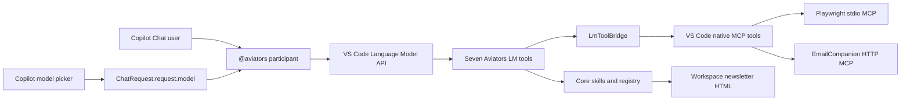
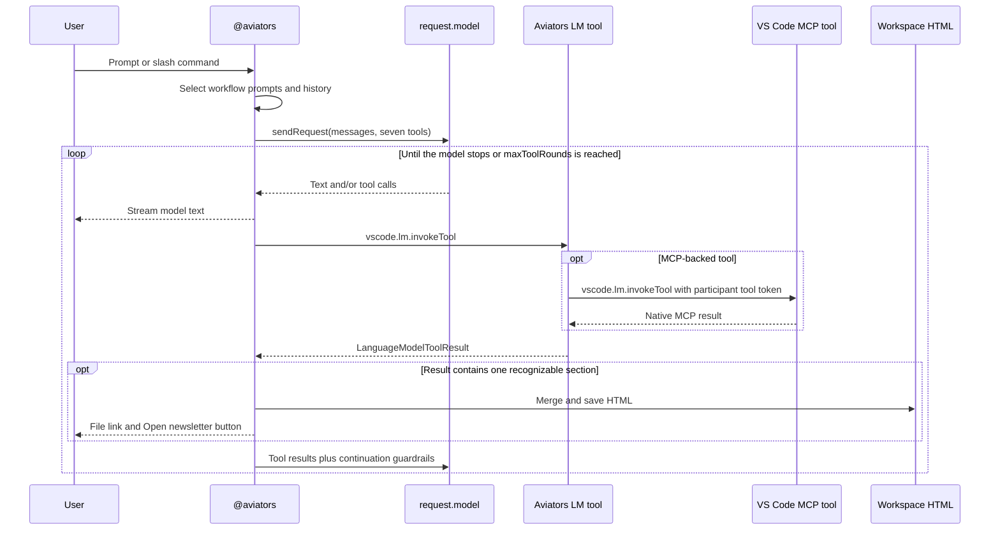
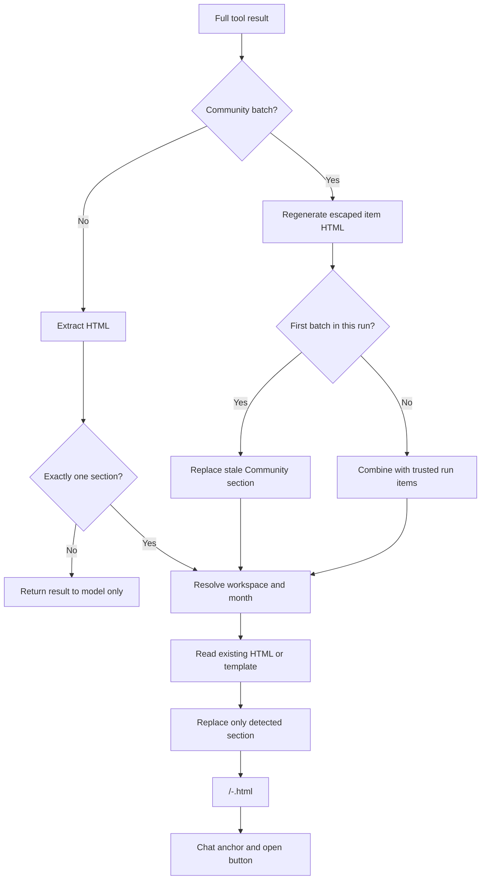

# Aviators Newsletter extension architecture

## Overview

Aviators Newsletter is a Visual Studio Code extension. It does not host an Express API, web UI, or model endpoint. GitHub Copilot Chat supplies the selected language model, VS Code supplies the chat/tool/MCP APIs, and the extension supplies newsletter orchestration, deterministic section builders, MCP-backed data tools, and workspace HTML output.



## Runtime components

| Component | Location | Responsibility |
|---|---|---|
| Extension activation | `src/extension/extension.ts` | Register the participant, tools, commands, output manager, LinkedIn session commands, and MCP provider. |
| Chat participant | `src/extension/participant.ts` | Route slash commands, build prompts, use `request.model`, run the tool loop, enforce limits, and stream chat output. |
| Language-model tools | `src/extension/toolRegistry.ts` | Register four local section/date tools and three MCP-backed data tools. |
| MCP bridge | `src/extension/lmToolBridge.ts` | Resolve MCP tool names from `vscode.lm.tools` and invoke them with the chat request's tool token. |
| Native MCP provider | `src/extension/mcpProvider.ts` | Programmatically define Playwright stdio and EmailCompanion HTTP servers. |
| Configuration/secrets | `src/extension/config.ts` | Read VS Code settings and store/read/delete the EmailCompanion API key through `SecretStorage`. |
| LinkedIn session | `src/extension/linkedinSession.ts` | Launch a headed Playwright MCP process, require manual sign-in/verification, save storage state, and validate cookies. |
| Output | `src/extension/output.ts` | Detect section HTML, safely merge it into a workspace file, and open previews. |
| Core registry | `src/core/agent.ts` | Define four deterministic skills and MCP-backed core tool definitions. |
| Core prompts | `src/core/skillPrompts.ts` | Provide workflow-specific prompts and anti-fabrication rules. |
| Newsletter utilities | `src/core/newsletter.ts` | Parse Q&A, detect section anchors, summarize tool results, and assemble the document. |

## Activation and contributions

`package.json` declares:

- Chat participant ID `aviators.newsletter`, exposed as `@aviators`.
- Slash commands `/newsletter`, `/ace`, `/product`, `/community`, and `/preview`.
- Seven language-model tools.
- Four Command Palette commands.
- Six `aviators.*` settings.
- MCP server definition provider ID `aviators.newsletter`.
- Extension entry point `dist/extension.cjs`.

`activate()` creates shared runtime objects and adds every registration/disposable to the extension context. The extension is activated by its participant, tools, commands, or MCP provider.

## Chat request flow



### Model selection and token control

The participant uses `ChatRequest.request.model`; it never creates an Azure/OpenAI client and has no independent model configuration. The user selects the model in Copilot Chat.

Before each model request, the participant counts tokens with the selected model. It preserves the system guardrails and current prompt, then trims older history/tool groups if necessary. Tool rounds are limited by `aviators.maxToolRounds` (default 12, allowed range 1-50). Individual tool invocations have a two-minute timeout.

### Command routing

- `/newsletter` injects all workflows and requires Ace Aviator → Product Group → Community order.
- `/ace` injects only the Ace Aviator workflow.
- `/product` injects date-window and Product Group workflows.
- `/community` injects date-window and Community workflows.
- `/preview` bypasses the model and opens an existing newsletter.
- A request without a command uses keyword-based skill detection.

The base and workflow prompts require real user/tool data and prefer omission or an explicit failure over fabricated content.

## Seven language-model tools

The tool list passed to the selected model is fixed:

| Registered tool | Execution |
|---|---|
| `aviators_computeDateWindow` | Local deterministic date-window skill. |
| `aviators_createAceAviator` | Local deterministic Ace Aviator HTML skill. |
| `aviators_createProductGroupNews` | Local deterministic Product Group HTML skill. |
| `aviators_createCommunityNews` | Local deterministic escaped Community batch skill. |
| `aviators_scrapeLinkedIn` | Core registry tool backed by Playwright MCP navigation and snapshots. |
| `aviators_resolveRedirects` | Core registry tool backed by Playwright MCP navigation. |
| `aviators_getTechCommunityBlogPosts` | Core registry tool backed by Playwright MCP navigation and snapshots. |

The first four tools call core `execute` functions directly. The final three create an `LmToolBridge`, rebuild the core registry with that bridge, and invoke native MCP tools through `vscode.lm.invokeTool`. LinkedIn scraping and redirect resolution can request user confirmation before network access.

The core registry also defines lower-level EmailCompanion and Playwright operations used by workflow code, including `getEmailFromMCP`, `playwright_navigate`, `playwright_snapshot`, `playwright_click`, and `playwright_type`.

## Native MCP server providers

`AviatorsMcpServerDefinitionProvider` returns definitions only when `aviators.newsletter.enableMcpProvider` is enabled.

### Playwright

- Type: `McpStdioServerDefinition`.
- Command/arguments: `aviators.playwright.mcpCommand`.
- Default: Docker running `mcr.microsoft.com/playwright/mcp`.
- Added runtime arguments: `--isolated`, `--headless` when configured, and `--storage-state` only after extension global-storage `storage.json` exists. The default Docker command bind-mounts global storage and uses a container-visible storage path.
- Purpose: browser navigation, snapshots, LinkedIn activity retrieval, redirect resolution, and Tech Community retrieval.

Because the extension registers this definition programmatically, a workspace `.vscode/mcp.json` containing the same Playwright server would duplicate it and is not part of the repository.

### EmailCompanion

- Type: `McpHttpServerDefinition`.
- URI: `aviators.email.mcpEndpoint`; remote endpoints require HTTPS, while HTTP is accepted only for exact loopback hosts (`localhost`, `127.0.0.1`, or `::1`).
- Authentication: `X-API-Key` populated from VS Code `SecretStorage`.
- Purpose: retrieve the Ace Aviator email through the EmailCompanion MCP service.

The endpoint remains a normal VS Code setting. The API key is never stored in repository configuration.

## LinkedIn authentication state

The **Aviators: Sign in to LinkedIn** command starts a separate headed MCP process:

1. Create a persistent profile directory under extension global storage.
2. Convert the default Docker configuration to local `npx @playwright/mcp@latest`, because a visible browser is required.
3. Navigate to LinkedIn login.
4. Wait for the user to complete credentials and any manual LinkedIn verification.
5. Save `storage.json`.
6. Validate that a non-expired `li_at` authentication cookie is present on an exact LinkedIn domain.
7. Close the browser and MCP process.

The status command validates the saved state and offers to start sign-in when it is absent, invalid, or expired. Authentication challenges cannot be automated reliably; manual verification is an expected requirement.

## Workspace output flow

Ace Aviator and Product Group skills return `{ success, html, ... }`. Community calls return a structured `{ success, kind: "communityNewsBatch", items, batchHtml, hasMore, ... }` containing only the new escaped batch. `NewsletterOutputSession` handles the full tool result before any model-context truncation:

- `aceaviator`
- `productnews`
- `communitynews`



Target selection prefers explicit request references, then the active editor's workspace, then a single workspace, then a workspace picker. The configured output path must remain relative to the workspace. Writes are serialized per file to prevent overlapping updates.

Existing documents are split using section headings and merged with the built-in table-of-contents/template. `/preview` and the open command use `openTextDocument`/`showTextDocument` to open the HTML in an editor and never start a web server.

Community accumulation is extension-state-backed rather than model-backed. Each participant request owns an opaque generation token: its first successful batch replaces the persisted Community section, and later batches combine with structured items retained for that same generation. A newer generation invalidates older continuations, duplicate URLs are removed, and the complete section is regenerated under one canonical heading. Prior newsletter HTML and the generation token are not part of the tool schema, so the model cannot expose or forge either state.

## Source layout

```text
src/
├── extension/
│   ├── extension.ts          activation and registrations
│   ├── participant.ts        Copilot Chat/model tool loop
│   ├── toolRegistry.ts       seven language-model tools
│   ├── lmToolBridge.ts       VS Code MCP tool invocation bridge
│   ├── mcpProvider.ts        native MCP definitions
│   ├── linkedinSession.ts    headed sign-in/session validation
│   ├── output.ts             workspace HTML persistence
│   └── config.ts             settings and SecretStorage
└── core/
    ├── agent.ts              skill/tool registry
    ├── skillPrompts.ts       workflow prompts
    ├── newsletter.ts         document utilities/template
    ├── mcpBridge.ts          bridge contracts/session validation
    ├── emailTools.ts         EmailCompanion tool
    ├── playwrightTools.ts    Playwright-backed data tools
    ├── dateWindow.ts         date-window skill
    ├── aceAviator.ts         Ace Aviator skill
    ├── productGroup.ts       Product Group skill
    ├── communityNews.ts      Community skill
    └── types.ts              shared definitions
test/                         plain TypeScript test scripts
esbuild.mjs                   extension bundler
package.json                  VS Code manifest and scripts
```

## Build, test, and distribution

1. `npm run compile` runs `tsc --noEmit` and bundles the CommonJS extension entry with esbuild.
2. `npm run lint` runs ESLint across the repository.
3. `npm test` compiles core/test TypeScript into `out/` and runs `out/test/run.js`.
4. `npm run package` invokes the VSIX prepublish compile and `vsce package --no-dependencies`.
5. A tagged GitHub release workflow repeats lint/test/package and uploads `aviators-newsletter.vsix`.

Release VSIX files are the documented distribution mechanism.
