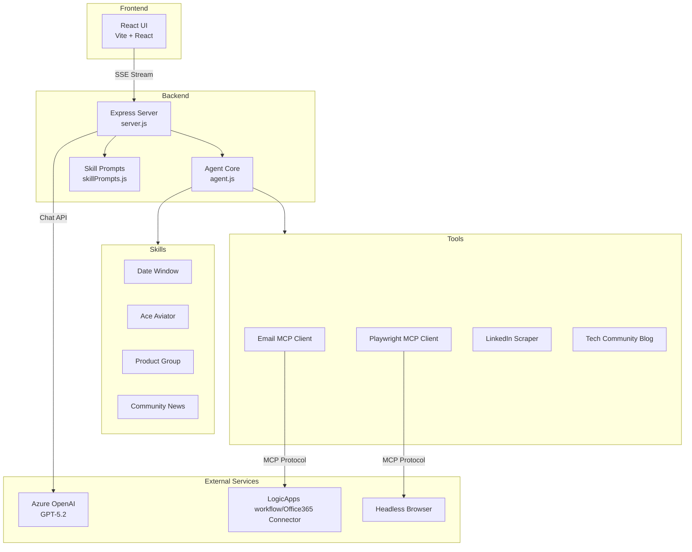
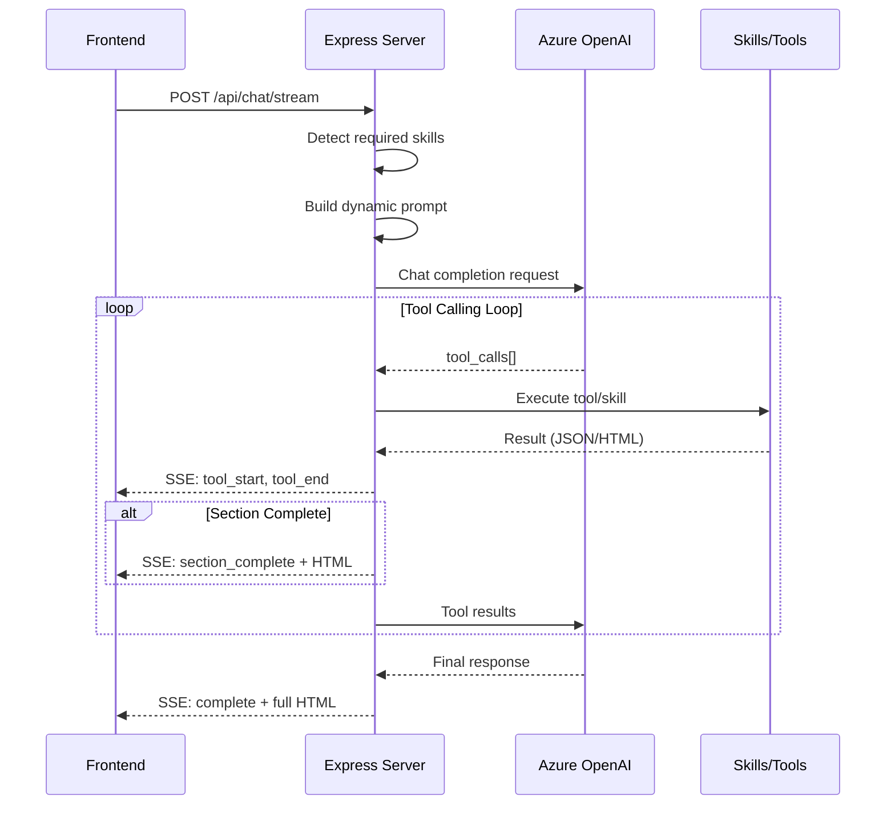
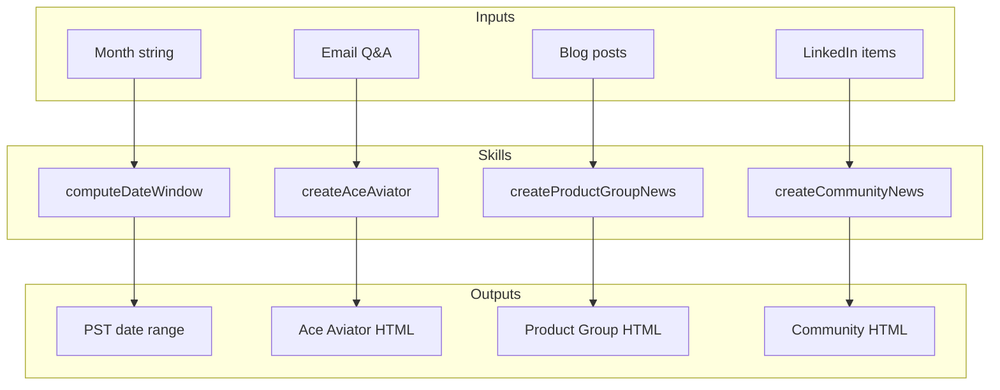
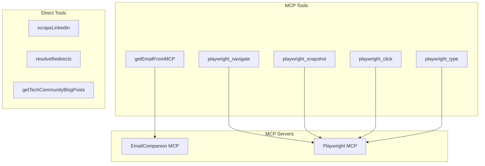
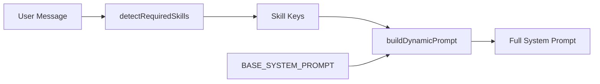
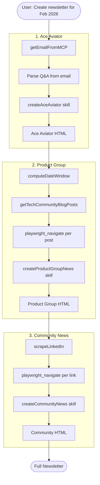
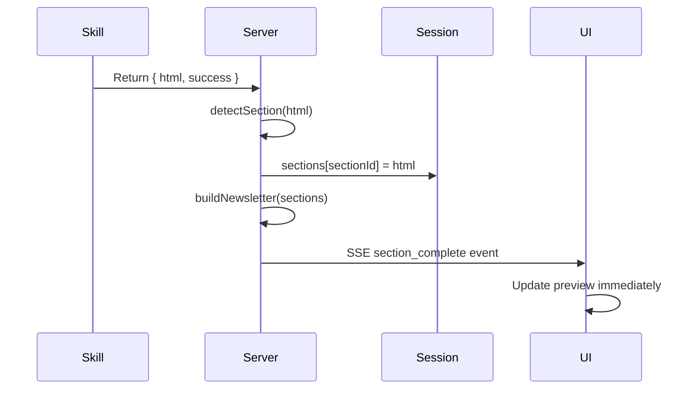

# Architecture Documentation

## Overview

The Logic Apps Aviators Newsletter Agent is an AI-powered application that automates the creation of the Logic Apps Aviators Newsletter. It uses Azure OpenAI (GPT-5.2) as the reasoning engine, with a modular skill and tool architecture that enables the LLM to gather data from multiple sources and generate formatted HTML content.



## System Components

### 1. Frontend (UI)

**Location:** `ui/`

The frontend is a React single-page application built with Vite.

| File | Purpose |
|------|---------|
| `App.jsx` | Main component with chat interface and newsletter preview |
| `App.css` | Styling including Tech Community blog preview styles |
| `index.html` | Entry point with Logic Apps favicon |

**Key Features:**
- Split-pane layout: Chat on left, HTML preview on right
- Server-Sent Events (SSE) for real-time section updates
- Copy HTML to clipboard functionality
- Session persistence (save/load newsletter state)

### 2. Backend Server

**Location:** `src/server.js`

Express.js server that orchestrates the AI agent loop.



**Key Endpoints:**

| Endpoint | Method | Purpose |
|----------|--------|---------|
| `/api/chat/stream` | POST | Streaming chat with SSE updates |
| `/api/chat` | POST | Non-streaming chat (legacy) |
| `/api/template` | GET | Get empty newsletter template |
| `/api/newsletter/save` | POST | Save newsletter to disk |
| `/api/newsletter/load` | GET | Load saved newsletter |
| `/api/session/:id` | DELETE | Clear session |

**Session Management:**
- Sessions stored in-memory (`Map`)
- Each session tracks: messages, sections, loaded skills
- Sections are updated incrementally as skills complete

### 3. Agent Core

**Location:** `src/agent.js`

Central configuration and registry for skills and tools.

```mermaid
graph LR
    subgraph "Agent Core"
        Config[agentConfig]
        SkillRegistry[skills{}]
        ToolRegistry[tools{}]
    end
    
    subgraph "Exports"
        ExecuteSkill[executeSkill]
        ExecuteTool[executeTool]
        GetDefs[getSkillDefinitions<br/>getToolDefinitions]
    end
    
    Config --> ExecuteSkill
    SkillRegistry --> ExecuteSkill
    ToolRegistry --> ExecuteTool
    SkillRegistry --> GetDefs
    ToolRegistry --> GetDefs
```

**Agent Configuration:**
```javascript
{
  name: 'Logic Apps Aviators Newsletter Editor',
  modes: { discover, create, edit },
  structure: [toc, aceAviator, productNews, communityNews],
  guardrails: ['No fabrication', 'Use only provided context', ...]
}
```

### 4. Skills

Skills are high-level operations that generate newsletter sections. Each skill:
- Has a name, description, and JSON Schema parameters
- Returns structured data including HTML output
- Is callable by the LLM via function calling

**Location:** `src/skills/`



| Skill | File | Purpose |
|-------|------|---------|
| `computeDateWindow` | `dateWindow.js` | Calculate PST newsletter window (first Tuesday → first Sunday) |
| `createAceAviator` | `aceAviator.js` | Generate Q&A section from email interview |
| `createProductGroupNews` | `productGroup.js` | Generate table of Tech Community blog posts |
| `createCommunityNews` | `communityNews.js` | Generate community contribution summaries |

### 5. Tools

Tools are lower-level operations for data retrieval. They interface with external services via MCP (Model Context Protocol) or direct execution.

**Location:** `src/tools/`



| Tool | File | Purpose |
|------|------|---------|
| `getEmailFromMCP` | `emailMcpClient.js` | Search and retrieve emails via Graph API |
| `playwright_navigate` | `mcpClient.js` | Navigate browser to URL, get page content |
| `playwright_snapshot` | `mcpClient.js` | Take accessibility snapshot of page |
| `scrapeLinkedIn` | `playwrightTool.js` | Scrape LinkedIn activity posts |
| `getTechCommunityBlogPosts` | `mcpClient.js` | Fetch Tech Community blog listing |

### 6. Skill Prompts

**Location:** `src/prompts/skillPrompts.js`

Dynamic prompt loading system that injects detailed skill instructions only when needed.



**Skill Detection:**
- Analyzes user message for keywords
- Returns array of skill keys to load
- "create newsletter for February" → loads all skills
- "update ace aviator" → loads only aceAviator skill

## Data Flow

### Newsletter Generation Flow



### Section Update Flow



## Key Design Patterns

### 1. On-Demand Prompt Loading
Skills prompts are only loaded when detected in user message, keeping context window efficient.

### 2. Sequential Processing Guardrail
GPT-5.2 tends to parallelize tasks. The system enforces sequential section processing to prevent data mixing.

### 3. Anti-Fabrication Guardrail
Multiple layers prevent the LLM from inventing content:
- System prompt explicit rules
- Tool result validation
- Skill-level fake name detection

### 4. MCP Integration
Uses Model Context Protocol for:
- Email retrieval (EmailCompanion MCP)
- Browser automation (Playwright MCP)

### 5. SSE Streaming
Real-time updates to UI as sections complete, providing immediate feedback.

## File Structure

```
aviators-code-agent/
├── src/
│   ├── server.js           # Express API server
│   ├── agent.js            # Agent core configuration
│   ├── chat.js             # Chat utilities
│   ├── index.js            # CLI entry point
│   ├── prompts/
│   │   └── skillPrompts.js # Dynamic skill prompts
│   ├── skills/
│   │   ├── dateWindow.js   # Date window calculation
│   │   ├── aceAviator.js   # Ace Aviator section
│   │   ├── productGroup.js # Product Group section
│   │   └── communityNews.js # Community section
│   └── tools/
│       ├── index.js        # Tool exports
│       ├── emailMcpClient.js # Email MCP client
│       ├── mcpClient.js    # Playwright MCP client
│       ├── emailTool.js    # Email utilities
│       └── playwrightTool.js # LinkedIn scraper
├── ui/
│   ├── src/
│   │   ├── App.jsx         # Main React component
│   │   ├── App.css         # Application styles
│   │   └── main.jsx        # React entry point
│   └── public/
│       └── logic-apps-logo.svg
├── test/                   # Test files
├── saved/                  # Persisted newsletters
└── outputs/                # Scraped data cache
```

## Configuration

### Azure OpenAI
```javascript
{
  endpoint: 'https://la-agentic-customer-advisory-program.cognitiveservices.azure.com/',
  apiVersion: '2025-04-01-preview',
  model: 'gpt-5.2',
  max_completion_tokens: 8192
}
```

### MCP Servers
- **Playwright MCP**: Browser automation for web scraping
- **EmailCompanion MCP**: Microsoft Graph API for email retrieval

## Error Handling

1. **Tool Failures**: Reported to user with option to provide data manually
2. **Rate Limiting**: Delays between LinkedIn requests (4000ms)
3. **Session Timeout**: In-memory sessions persist until server restart
4. **Content Validation**: Skills reject fabricated content (fake names)
